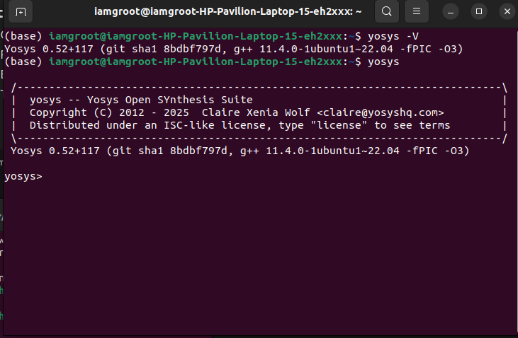
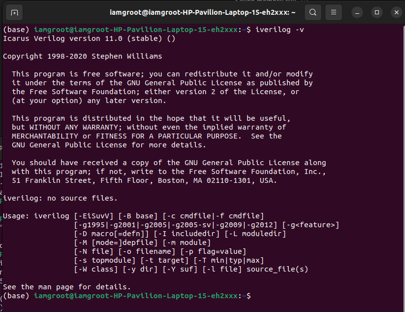
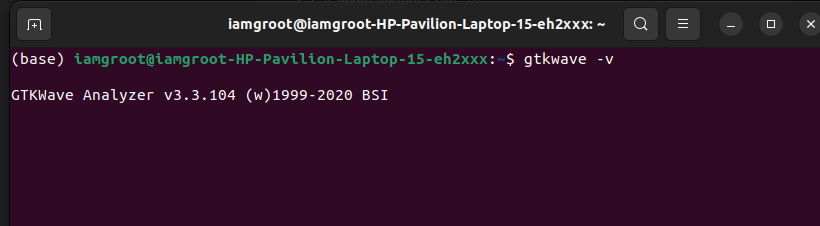

# OpenLane Toolchain Setup (Native Install)

This repository provides installation instructions and setup scripts for a digital design toolchain including:

- **Yosys** (from YosysHQ)
- **Icarus Verilog (iverilog)**
- **GTKWave**

---

## System Requirements

- **Operating System:** Ubuntu 20.04 LTS or higher (64-bit)
- **RAM:** ≥8 GB recommended
- **Disk Space:** ≥50 GB (OpenLane builds + temp files)
- **CPU:** 4 cores or more
- **Git:** Latest version
- **Python:** ≥3.10

---

## Installation Steps (Native)

### 1. Update system and install dependencies
```bash
sudo apt update && sudo apt upgrade -y
sudo apt install -y build-essential git curl wget unzip python3 python3-pip bzip2 pkg-config cmake \
libreadline-dev libffi-dev tcl-dev libboost-all-dev libeigen3-dev iverilog gtkwave
```
---

### 2. Install Yosys
```bash
git clone https://github.com/YosysHQ/yosys.git
cd yosys
make config-gcc
make
sudo make install
yosys -V
```

---

### 3. Install Icarus verilog
```bash
sudo apt install -y iverilog
iverilog -v
```

---

### 4. Install GTKwave
```bash
sudo apt install -y gtkwave
gtkwave --version
```

