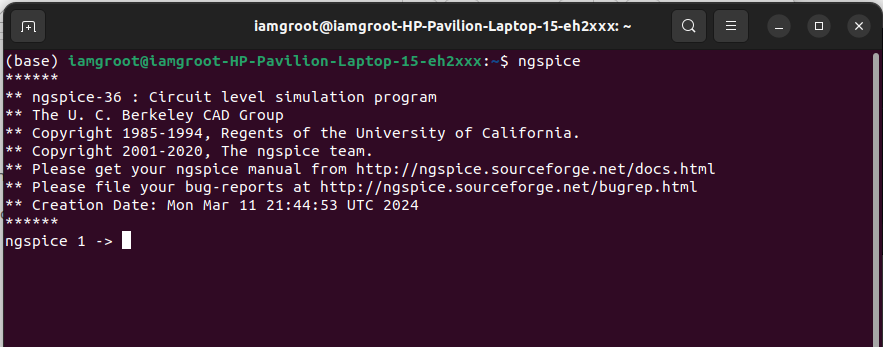
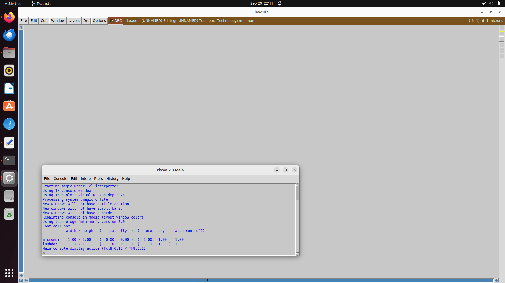

# RISC-V Workshop: Project Log

This repository documents my progress and deliverables for a 10-week, hands-on workshop focused on designing and taping out a custom RISC-V System on a Chip (SoC). This is a comprehensive log of the journey from initial design concepts and toolchain setup to the final hardware fabrication files.

---

## Week 1: The Installation and Foundation

The first week was dedicated to installation of the necessary tools and getting familiar with the same. 

 |   Key Tools   |   Description   |
 |---------------|-----------------|
 |     Yosys     | The synthesis engine for transforming Verilog into a gate-level netlist.|
 |iverolog|A high-speed simulator for design verification.|
 |GTKWave|A waveform viewer for debugging signal behavior.|
 |NGspice|Circuit simulation and various other analysis.|
 |Magic|Layout Design|
 
 ---

### System Requirements

- **Operating System:** Ubuntu 20.04 LTS or higher (64-bit)
- **RAM:** ≥8 GB recommended
- **Disk Space:** ≥50 GB (OpenLane builds + temp files)
- **CPU:** 4 cores or more
- **Git:** Latest version
- **Python:** ≥3.10

---

### Installation Steps (Native)

#### 1. Update system and install dependencies
```bash
sudo apt update && sudo apt upgrade -y
sudo apt install -y build-essential git curl wget unzip python3 python3-pip bzip2 pkg-config cmake \
libreadline-dev libffi-dev tcl-dev libboost-all-dev libeigen3-dev iverilog gtkwave
```
---

#### 2. Install Yosys
```bash
git clone https://github.com/YosysHQ/yosys.git
cd yosys
make config-gcc
make
sudo make install
yosys -V
```

---

#### 3. Install Icarus verilog
```bash
sudo apt install -y iverilog
iverilog -v
```

---

#### 4. Install GTKwave
```bash
sudo apt install -y gtkwave
gtkwave --version
```


---

#### 5. Install NGSPICE
After downloading the tarball from https://sourceforge.net/projects/ngspice/files/ to a local
directory, unpack it using:
```bash
tar -zxvf ngspice-37.tar.gz
cd ngspice-37
mkdir release
cd release
./configure --with-x --with-readline=yes --disable-debug
make
sudo make install
```

---

#### 6. Install Magic
```bash
sudo apt-get install m4
sudo apt-get install tcsh
sudo apt-get install csh
sudo apt-get install libx11-dev
sudo apt-get install tcl-dev tk-dev
sudo apt-get install libcairo2-dev
sudo apt-get install mesa-common-dev libglu1-mesa-dev
sudo apt-get install libncurses-dev
git clone https://github.com/RTimothyEdwards/magic
cd magic
./configure
make
make install
```

